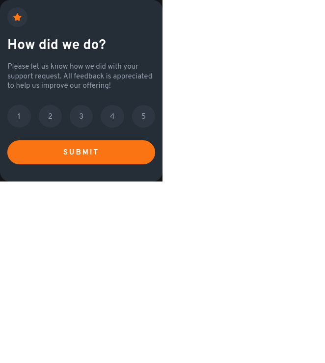

# Frontend Mentor - Interactive rating component solution

This is a solution to the [Interactive rating component challenge on Frontend Mentor](https://www.frontendmentor.io/challenges/interactive-rating-component-koxpeBUmI). Frontend Mentor challenges help you improve your coding skills by building realistic projects. 

## Table of contents

- [Overview](#overview)
  - [The challenge](#the-challenge)
  - [Screenshot](#screenshot)
  - [Links](#links)
- [My process](#my-process)
  - [Built with](#built-with)
  - [What I learned](#what-i-learned)
- [Author](#author)

## Overview

### The challenge

Users should be able to:

- View the optimal layout for the app depending on their device's screen size
- See hover states for all interactive elements on the page
- Select and submit a number rating
- See the "Thank you" card state after submitting a rating

### Screenshot

### Links

- [Solution](https://your-solution-url.com)
- [Site](https://aevim.github.io/interactive-rating-component-main/)

## My process

### Built with

- Semantic HTML5 markup
- Flexbox
- Less
- Jquery
- Mobile-first workflow

### What I learned
The js part was really fun. I had a bit of a problem with overthinking, but taking 
the 'baby steps' advice helped alot. I use a bit of less, which I have never used before.
Jquery was very helpfull with those lengthy js DOM codes.  

## Author

- Frontend Mentor - [@aevim](https://www.frontendmentor.io/profile/aevim)

